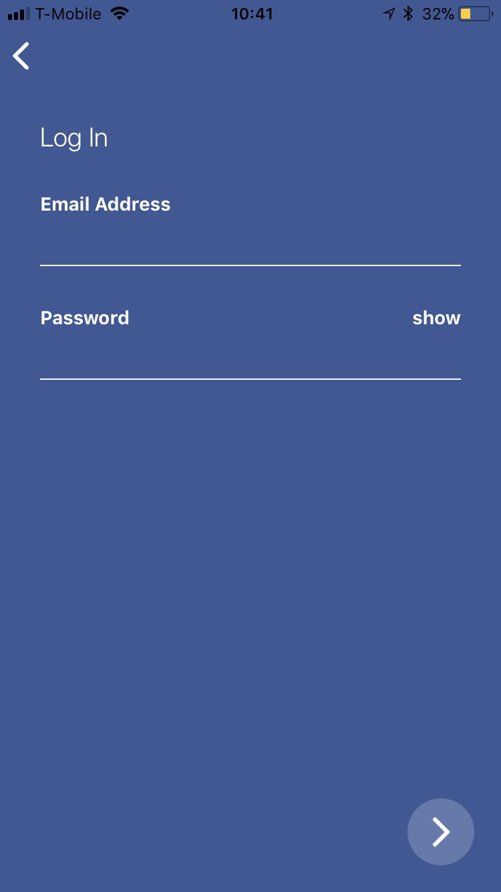
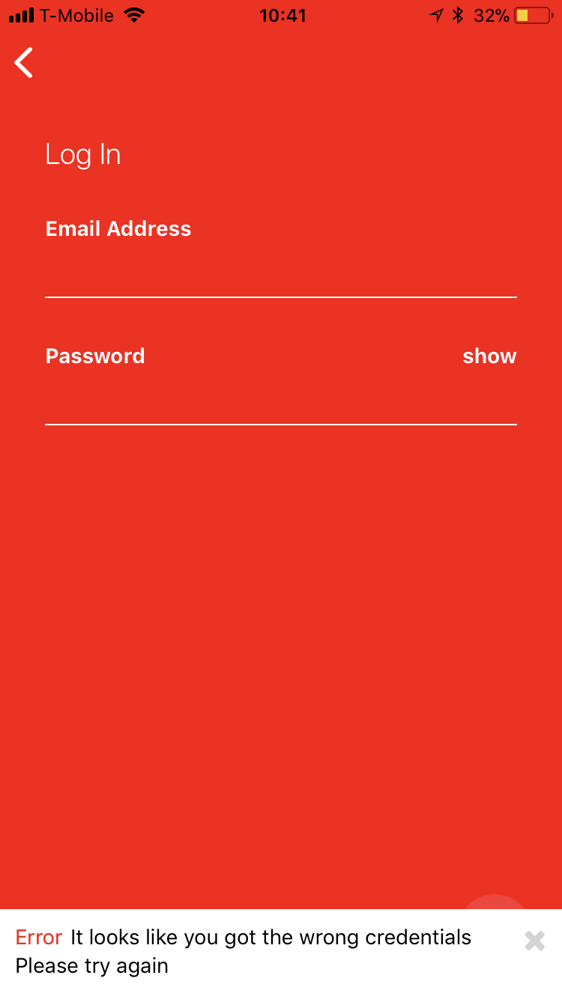

# xas
xas app

Home cooked meals mobile app using React Native & Redux. No backend integration yet

<table>
  <tr>
    <td></td>
    <td></td>
    <td></td>
    <td></td>
  <tr>
  <tr>
    <td></td>
    <td></td>
    <td></td>
    <td></td>
  <tr>
</table>

## How to use
- Clone
- Run `npm install` in the terminal
- Run Expo emulator using Expo XDE

## Login details
- email: velez@velezda.com
- password: 12345

## Dependencies
- react
- react-native
- react-native-vector-icons
- react-navigation
- react-redux
- redux
- redux-logger
- redux-thunk
